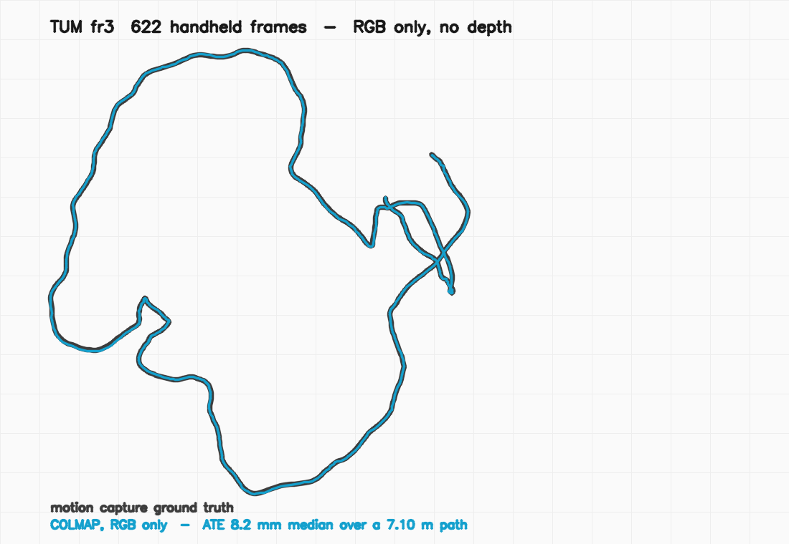
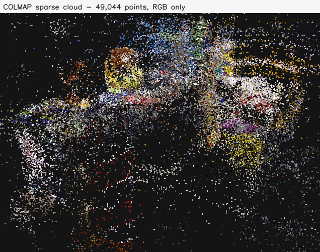
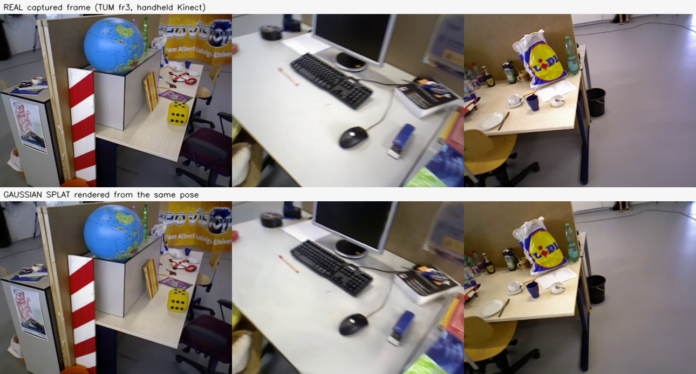
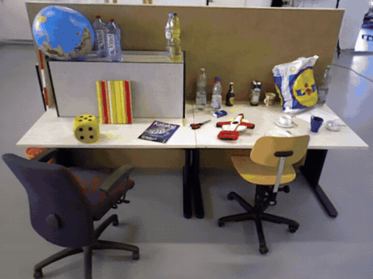

# Shape without scale

**One RGB camera. 622 frames of ordinary handheld video. 8.2 mm from motion capture — and no
idea how big the room is.**

By **Yosi Refaeli** — Senior Technical Artist & AI Systems

Everything below runs on **TUM RGB-D `fr3/long_office_household`**, which is public and has
motion-capture ground truth, so you can check the result instead of taking my word for it.
That dataset ships a Kinect depth channel. It is **never used**. No depth, no IMU, no LiDAR.

---

## The whole thing, in four pictures

### 1. Two trajectories



There are two curves in that plot. One is motion capture. One is a single RGB camera. You
cannot see the difference, because it is **8.2 mm over a 7.10 m path** — max deviation 25.6 mm.

You also cannot see the thing making it work: a scale factor of **0.566**, which came from the
ground truth and not from the images. Hold that thought.

### 2. What structure-from-motion actually gives you



**49,044 triangulated points** from 622 frames, at 0.739 px mean reprojection error. Every
frame registered — 622 of 622. This is the entire geometric input to everything that follows.

### 3. Trained on nothing but those points



Top row is the captured video. Bottom row is a Gaussian splat rendered from the same camera
pose, trained only on the frames and COLMAP's own sparse points — **29.27 dB / 0.913 SSIM**.
No depth supervision, no priors.

### 4. It is a real 3D scene



---

## The measurement that matters

```
$ python ate_scale.py --est sparse/0 --gt groundtruth/0

622 estimated poses, 622 reference, 622 matched
reference trajectory extent: 7.10 m

  SE(3)   scale NOT solved   scale   1.0000   ATE median  1570.2 mm   ( 22.12% of extent)
  Sim(3)  scale solved out   scale   0.5661   ATE median     8.2 mm   (  0.11% of extent)

  The gap between those two lines is the part monocular vision does not give you.
```

**191× apart. Same reconstruction, same frames.** The only difference is whether one number is
allowed to float.

The *shape* of the trajectory is recovered to 8 millimetres over seven metres. The *size* of it
is not recovered at all. Run dense RGB-D SLAM on the same footage and it returns real metres —
and **124 mm** of drift. Fifteen times worse, and correct in a way the 8.2 mm never is.

Every impressive monocular accuracy figure you have read is the second line. That is not
cheating; it is the standard and correct way to evaluate a monocular system. But the scale had
to come from somewhere, and it is worth being explicit about which line you are quoting.

---

## Reproduce it

Total runtime on an RTX 4070 Ti: ~6 min of SfM, ~25 min of splat training.
Dataset: https://cvg.cit.tum.de/data/datasets/rgbd-dataset/download

### 1. Structure from motion — RGB only

```bash
IM=path/to/fr3_long_office/rgb          # 622 PNGs, 640x480, real handheld Kinect
W=work/sfm

colmap feature_extractor \
  --database_path $W/db.db --image_path "$IM" \
  --ImageReader.single_camera 1 --ImageReader.camera_model SIMPLE_RADIAL \
  --SiftExtraction.max_num_features 16384

colmap sequential_matcher \
  --database_path $W/db.db --SequentialMatching.overlap 15

colmap mapper \
  --database_path $W/db.db --image_path "$IM" --output_path $W/sparse
```

Sequential matching, not exhaustive — this is a continuous handheld video, so neighbours in
time are neighbours in space, and you get the same result for a fraction of the pairs.

Expected: `622 / 622 registered, 49,044 points, 0.739 px, 6.1 min`.

> **Gotcha.** `--SiftExtraction.max_image_size` does not exist in current COLMAP; it is
> `--FeatureExtraction.max_image_size`. An unrecognised option makes `feature_extractor` exit
> immediately, and the rest of the chain then runs happily on an **empty database** and
> reports `No images with matches` — which points nowhere near the real cause. Confirm feature
> extraction actually logged features before moving on.

### 2. Undistort → canonical PINHOLE dataset

```bash
colmap image_undistorter \
  --image_path "$IM" --input_path $W/sparse/0 \
  --output_path work/undistorted --output_type COLMAP

mkdir -p work/undistorted/sparse/0
mv work/undistorted/sparse/*.bin work/undistorted/sparse/0/
```

> **Gotcha.** Do this even if your trainer claims to undistort on the fly. LichtFeld Studio
> undistorts every image at load for a `SIMPLE_RADIAL` model and blows its pinned-memory
> allocator — 3,396 failures, dead at iteration 0, with 47 GB of host RAM free, so it looks
> like an OOM and is not. An already-PINHOLE dataset makes it vanish.

### 3. Train the splat

```bash
LichtFeld-Studio --headless \
  -d work/undistorted -o work/undistorted/run \
  -i 30000 --eval --test-every 8 --max-cap 2000000
```

Expected: `29.27 dB / 0.913 SSIM at 30k, 2M gaussians`.

### 4. Measure honestly

```bash
python ate_scale.py --est $W/sparse/0 --gt path/to/groundtruth_model/0
```

---

## Files

| file | what it does |
|---|---|
| `ate_scale.py` | Aligns a COLMAP model to reference poses twice — with and without a solved scale — so the gap is visible rather than implied |

`ate_scale.py` needs only numpy and works on any COLMAP **text** model, so it is reusable on
your own reconstructions. Pass it a binary model and it will tell you how to convert one.

## Author

**Yosi Refaeli** — Senior Technical Artist & AI Systems.
3D reconstruction, Gaussian splatting, and generative pipelines for capture-to-BIM work.

## License

MIT © 2026 Yosi Refaeli
